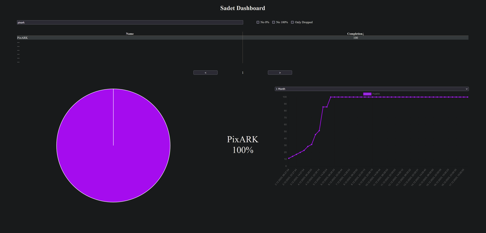
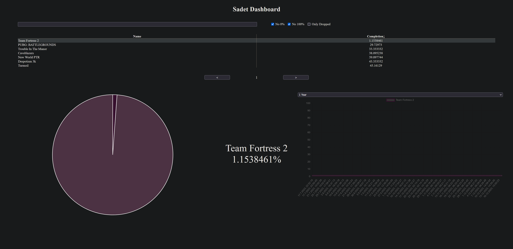
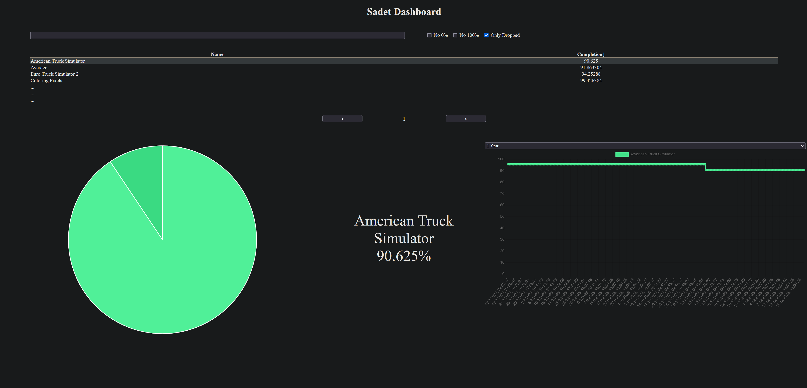

# sadet.autodb

A bundle of programs and systemd services which:
1. Automatically loads steam achievement data overtime using
[sadet](https://github.com/Joyersch/sadet),
running as a service.  
2. Allows for said data to be accessed by api.
3. Has its own dashboard for said data.

# Example Images from the Dashboard





# Note

There are many ways to install this software.
It just requires a postresql database server to connect to.

# Installation on Linux

First of all, this installation guide will be
for Debian // [Raspberry Pi OS](https://www.raspdberrypi.com/software/),
however this should work for all distros as well as windows.

This guide will be seperated into the following stages:
- Making sure the submodule are pulled
- Building the software (yes, you will need to do this yourself)
- Installing the newly-build software
- Creating the database
- Setting up the services
- Configuring the software

## Pulling Submodules

```shell
git submodule update --init --recursive
```

## Building the software

Note: You will need the `dotnet-sdk-6.0`
[(e.g. arch repo)](https://archlinux.org/packages/extra/x86_64/dotnet-sdk-6.0/)
in order to build.  
Please use your search engine of choice to look up on how to install the dotnet sdk.  
This also goes for all other stuff.  

Depending on where you want to install this, you will need to build
the software for different architecture. 
The `-a [achitecure]` argument sets the architecture. 

Since I'm building on linux, a `linux` prefix is already added to the architecture.  

The following will create a `publish` folder with all the files for the software.

### sadet

In the `sadet` directory run something along the lines of:

```sh
dotnet publish -c Release -a arm -o publish -p:PublishReadyToRun=true -p:PublishSingleFile=true -p:PublishTrimmed=true --self-contained true
```
This will create a single executable, which is sadly required do to the way,
the later python script calls the software.

### sadet.autodb.api

In the `sadet.autodb.api` directory run something along the lines of:


```sh
dotnet publish -c Release -a arm -o publish -p:PublishReadyToRun=true --self-contained true
```

## Installing the newly-build software

Move over the published files to the server / system where it is to be installed.   
Try to keep the files inside separate folders.  

The system requires `systemd`!

Note: The following actions require root privileges!

Create the folders:
- `/bin/sadet.autodb.api.d`
- `/bin/sadet.d`

Move / copy the files from the `publish` folder to the newly created folders.

**Important**:  
You may require to modify the executables using `chmod x+ [file]`.  
The files are:
- `/bin/sadet.autodb.api.d/sadet.autodb.api`
- `/bin/sadet.d/Sadet`

Lastly you need to create a symbolic link for `/bin/sadet.d/Sadet` to `/bin/sadet`:
```shell
ln /bin/sadet.d/Sadet /bin/sadet
```
This is so you are able to call sadet from anywhere.

## Database

The Database system in use is Postgresql.

In `sadet.autodb.api` is a file called `create_database.sql`.

Execute the file to create the database.  
Here is an example on how you can go about this:
```shell
psql -f create_database.sql
```

## Services

In the directory `sadet.autodb.service` are two service files as well as a `sadet.output.d` folder.
The service files will need to be moved over to `/lib/systemd/system` or `/etc/systemd/system`.  
**Please edit the files beforehand with your own configuration**  
The `sadet.output.d`-folder can be placed anywhere, as long as systemd has access
to the folder and the path is set in the `sadet.autodb.service`-file.

## Configuring the software

To configure the used port, change the `sadet.autodb.api.service`-file.
Specifically the `--urls` option.

In the `sadet.output.d`-directory, in the `run.py` file,
add your steam api key in the `[STEAM_API_KEY]`-placeholder.  

The number after that, is for the steam profile, update this as well.  

Below you also need to update the postgresql connection.

In the `/bin/sadet.autodb.api.d/appsettings.json`-file, you will also need to update the postgresql connection.

## Finally

Lastly enable and start the services using `systemctl`.

If you did not change the url, you can access the dashboard under `[server-ip]:10875`.

If nothing is displaying, check the browser console.  

In the case of an CORS, change the url in `/bin/sadet.autodb.api.d/wwwroot/index.html`.  
